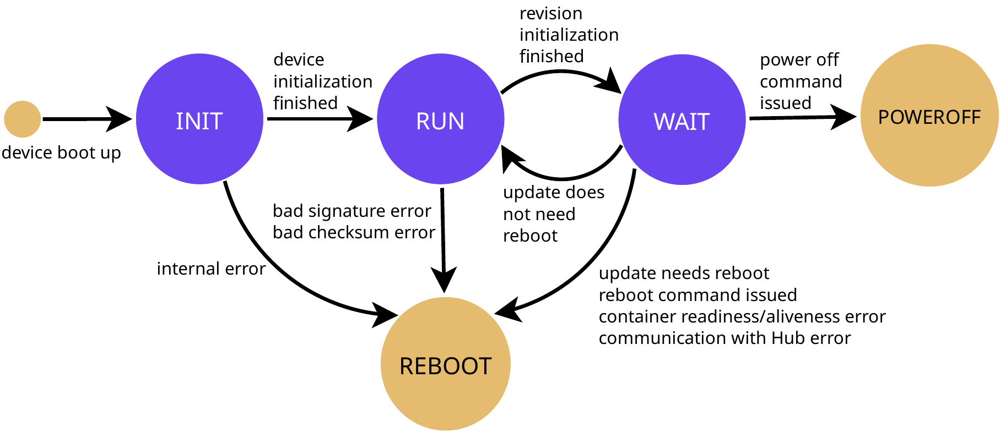

# Pantavisor Architecture

At a high level, Pantavisor is just in charge of two things: container orchestration and communication with the outside world.

## Container Orchestration

The software that is running in a Pantavisor-enabled device at a certain moment is called a [revision](revisions.md). A revision is composed by a [BSP](bsp.md) and a number of [containers](containers.md). Pantavisor is able to go from the current running revision to a new revision in a [transactional manner](updates.md).

Revisions, as well as other relevant data, are [stored](storage.md) on-disk in the device to make them persistent.

## Communication with the Outside World

Pantavisor-enabled devices need to communicate with the outside world to consume new [updates](updates.md), exchange [metadata](storage.md#metadata) or send [logs](storage.md#logs). Users can achieve this [remotely](remote-control.md) as well as [locally](local-control.md).

## Customisation

Pantavisor can be set up in different ways, offering [multi-level configuration](pantavisor-configuration-levels.md) as well as several [operational init modes](init-mode.md).

## Service Mesh

Containers running in the same revision can communicate with each other through `pv-xconnect`, Pantavisor's built-in service mesh. It handles service discovery and resource injection (Unix sockets, D-Bus, DRM, Wayland) between containers in a secure and declarative way. See [xconnect](xconnect.md).

## State Machine

To get a very simplified view on how Pantavisor works, you can take a look at its state machine:

Each state can be summarized as:

* **INIT**:
    - Prepare the base rootfs
    - Prepare [persistent storage](storage.md)
    - Parse [configuration](pantavisor-configuration-levels.md)
    - Choose [init mode](init-mode.md)
    - Initialize interaction with [bootloader](bsp.md#bootloader)
    - Initialize [log system](storage.md#logs)
    - Initialize [control socket](local-control.md)
    - Initialize [watchdog](watchdog.md)
* **RUN**:
    - Initialize the running [revision](revisions.md)
    - Check [object checksum](storage.md#artifact-checksum)
    - Check [revision signatures](storage.md#state-signature)
* **WAIT**:
    - Start [containers](containers.md) and check its [statuses](containers.md#status)
    - Manage any ongoing [update](updates.md), incluiding installation, verification, transition, etc.
    - Run [Pantacor Hub client full state machine](remote-control.md#state-machine)
    - Process [control socket](local-control.md) requests
    - Manage [metadata](storage.md#metadata)
    - Check and run [garbage collector](storage.md#garbage-collector)
