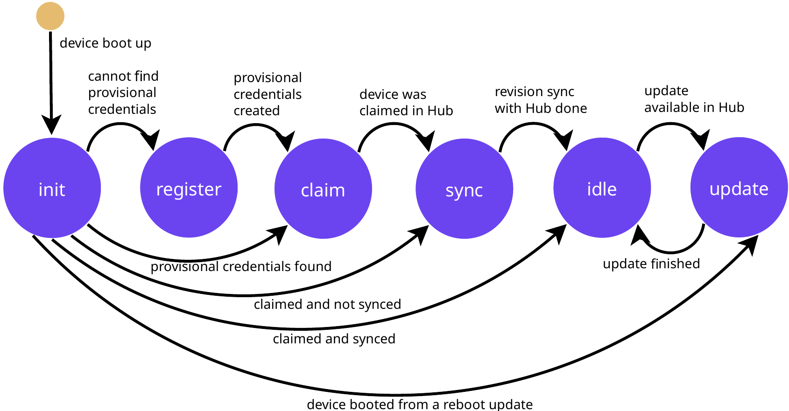

# Remote Control

This page is for explaining cloud-oriented ways of controlling your Pantavisor devices.

## Pantacor Hub

[Pantacor Hub](https://hub.pantacor.com) is our remote device state management system.

To interact with Pantacor Hub, you can either use the [web user interface](https://hub.pantacor.com), the [API](pantahub-base/README.md) or the [pvr CLI tool](pvr/README.md).

### Pantacor Hub Client

Pantavisor includes a build-in Pantacor Hub client which is [enabled by default](pantavisor-configuration.md#summary). To begin remote control and monitoring of devices with [Pantacor Hub](https://hub.pantacor.com), it is necessary to create an account and [claim the device to it](claim-device.md). From that moment on, the device will be attached to that account and will try to keep the connection with Pantacor Hub opened, except if a [local revision](pantavisor-commands.md#steps) is installed. In that case, the device will turn to [local control](local-control.md) until a [go remote command](pantavisor-commands.md#commands) is issued. This behavior can be avoided with the [remote always configuration](pantavisor-configuration.md#summary).

The client will mainly perform three things:

* Keeping the device up to date: the [revisions](revisions.md) form a trail of steps in Pantacor Hub. This trail is ordered according to the time of [deploying](deploy-a-new-revision.md) and will be consumed by Pantavisor step by step. After founding a new step, Pantavisor will parse the [revision State JSON](pantavisor-state-format-v2.md), download the artifacts into the [storage](storage.md#trails-and-objects) and [transition](updates.md) to the new revision.
* Sending [device metadata](storage.md#device-metadata) and receiving [user metadata](storage.md#user-metadata).
* Sending logs: sending [stored logs](storage.md#logs) up.

#### State Machine

The client state machine goes through the following stages:

!!! Note
    All states are independent from the [Pantavisor state machine](pantavisor-architecture.md#state-machine), but all their associated processes are run from its WAIT state.

!!! Note
    The client state can be consulted at any moment via [device metadata](pantavisor-metadata.md#device-metadata).

* **init**: means we are in remote mode and the client has been initialized.
* **register**: device is trying to register as a non-claimed device in the cloud. This credentials will be stored after reboot.
* **claim**: device is registered and is waiting to be claimed.
* **sync**: device has been claimed and will try to upload the objects and state JSON to the cloud.
* **login**: device is using its credentials to start a session with Hub.
* **wait hub**: device is waiting for Hub to reply. We also use this to decide whether the device is claimed or not.
* **report**: an update finished and device will continue uploading devmeta, downloading usrmeta while reporting its update status.
* **idle**: device has checked all objects and state JSON is in the cloud. This is where the device will spend most of its time, uploading devmeta, downloading usrmeta and waiting for new updates.
* **prep download**: a new update (same as a new state JSON) has been received and the device will now download the object metadata information for each of its objects. This includes object size, sha and download URL.
* **download**: all object metadata is now on memory and we can proceed dowloading all objects that are not already installed in disk. Then we will continue with progressing to the new revision.

## Other Remote Controllers

It is also possible to control Pantavisor using any other server. For that, it is necessary to implement a container that performs the communication between the server itself and [Pantavisor](local-control.md).

One example of this kind of setup is our [Azure IoT Hub client](https://github.com/Azure/iot-hub-device-update/tree/contributor/pantacor%2FPVContainer-ci).
