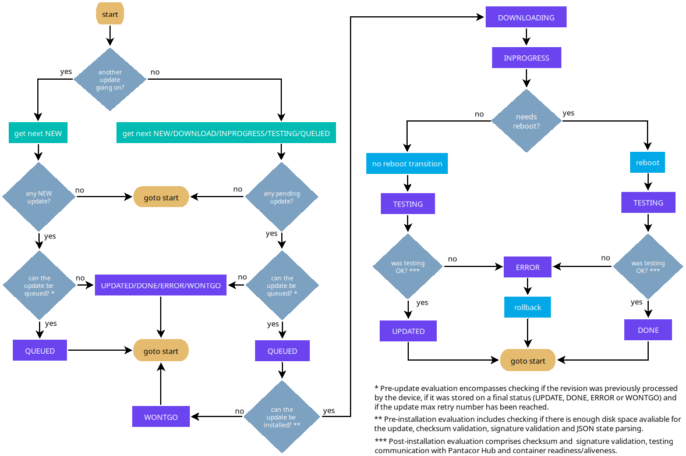
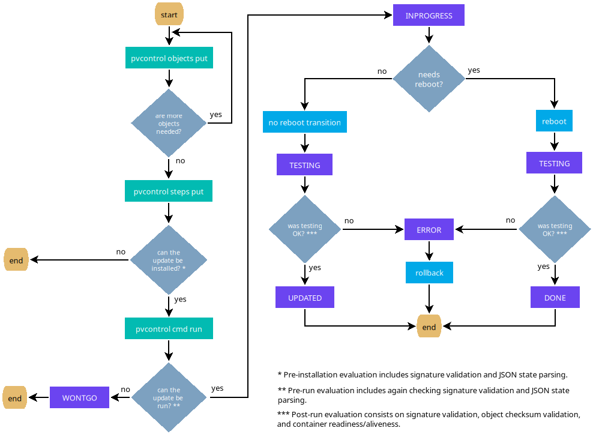

# Updates

Getting back to [revisions](revisions.md), these can be modified and upgraded, thus creating a new revision of the device.

## Flow

Updates will be processed differently depending on the source being [remote](remote-control.md#pantacor-hub) or [local](local-control.md).

### Remote

The diagram shows a high level concept of how [remote](remote-control.md#pantacor-hub) updates work. In this case, we have a [periodic](pantavisor-architecture.md#state-machine) routine that checks for pending updates upstream and executes the installation and transition to them one by one:

### Local

In this diagram, you can see how [local](local-control.md) updates work. In the case of this kind of update, we have a one-shot process triggered by a [run revision command](../reference/pantavisor-commands.md#commands):

## Progress

Pantavisor keeps the update progress information for each revision in [storage](storage.md#update-progress).

This info will also be reported to the cloud in case of the device being [remote](remote-control.md#pantacor-hub) and communication available at that moment.

Pantavisor will only progress to the new revision in case of success. Otherwise, no action or rollback will ensue, depending on the point where the error is detected. This is the list of possible update states:

* [NEW](#new)
* [SYNCING](#syncing)
* [QUEUED](#queued)
* [DOWNLOADING](#downloading)
* [INPROGRESS](#inprogress)
* [TESTING](#testing)
* [UPDATED](#updated)
* [DONE](#done)
* [WONTGO](#wontgo)
* [ERROR](#error)
* [CANCELLED](#cancelled)

### NEW

Initial state for [remote](remote-control.md#pantacor-hub) updates. Set by the cloud side.

### SYNCING

Device is syncing its first revision with the [cloud](remote-control.md#pantacor-hub). Set by the cloud side.

### QUEUED

Only valid for [remote](remote-control.md#pantacor-hub) updates.

Pantavisor has got the [state JSON](../reference/pantavisor-state-format-v2.md) of the new [revision](revisions.md), but is performing other operations and has put it to the queue to be processed later.

| Messages |
| ---------|
Retried X of Y |

### DOWNLOADING 

Only valid for [remote](remote-control.md#pantacor-hub) updates.

Downloading the artifacts for the new revision.

Object downloads are resumable: if a transfer is interrupted (dropped
connection, timeout, or a Hub-side error), Pantavisor keeps the partial file
on disk and retries with an HTTP `Range` request picking up from the last
byte received, instead of starting the object over from scratch. Since
objects are immutable and content-addressed by their sha256, any partial
file left over from an earlier attempt is always safe to resume from. If the
Hub does not honor the `Range` request (e.g. an older Hub without range
support) and answers with a full `200` response instead of `206 Partial
Content`, Pantavisor falls back gracefully and restarts that object's
download from scratch. This reuses the same retry loop as before — there is
no separate resume counter; a stuck object still only stops retrying once
the update itself hits its overall retry ceiling.

| Messages |
| ---------|
Retry X of Y |

### INPROGRESS

Installing or progressing to this revision. Transitions to new revisions can either require a [reboot](#reboot-transition) or [not](#non-reboot-transition).

[Hooks](hooks.md) fire at key points during installation: before and after the bootloader writes the new revision (`system-before-install-update` / `system-after-install-update`), and once the revision has been committed after a successful try-boot (`system-boot-done`).

To finish this state, it is necessary that all [status goals](containers.md#status-goal) existing in the new revision have been achieved. Also, in the case of a [remote](remote-control.md#pantacor-hub) update, Pantavisor needs to have performed communication with Pantacor Hub. If these two conditions are not met within a [configurable](../reference/pantavisor-state-format-v2.md#5-orchestration-groupsjson) time, Pantavisor will [rollback](#error) the revision.

| Messages |
| ---------|
Update objects downloaded |
Update applied |
Update installed |
Starting updated version |
Transitioning to new revision without rebooting |
Rebooting |

#### Reboot transition

Reboot transitions are performed based on the location of the changes belonging to the new [revision](revisions.md) update:

* In the root of the [status JSON](../reference/pantavisor-state-format-v2.md#1-root-level-statejson)
* In the [BSP](bsp.md)
* In any of the containers with a _system_ [restart policy](containers.md#restart-policy)
* In any [additional file](containers.md#configuration-overlay) that belongs to a container with _system_ [restart policy](containers.md#restart-policy)
* In any [additional file](containers.md#configuration-overlay) that does not belong to any container

In this case, Pantavisor will stop all the containers and reboot the board.

#### Non-reboot transition 

Non-reboot transitions are performed after an update that does not contain any changes in any of the components described for the [reboot transition](#reboot-transition).

In this case, Pantavisor will only stop the containers that were affected by the update and restart them with the recently installed new revision artifacts.

### TESTING

Waiting to see if the revision is stable. During this stage, Pantavisor checks if all containers are running and will [rollback](#error) if any of them exits. Besides that, in the case of a [remote](remote-control.md#pantacor-hub) update, it will also [rollback](#error) in case Pantacor Hub communication is lost.

If any container has a [stable_timeout](containers.md#stability-tracking), the commit is held even after the commit delay timer expires, until all containers have survived their stability window. If a container with [auto-recovery](containers.md#auto-recovery) exhausts its `max_retries` during TESTING, a rollback is triggered immediately regardless of the configured `backoff_policy`.

| Messages |
| ---------|
Awaiting to set rollback point if update is stable |
Awaiting to see if update is stable |
Waiting for all containers to become stable |

### UPDATED

The revision is stable, but the update did not need a board reboot, so the rollback point is not set until you [force a reboot](../reference/pantavisor-commands.md#commands).

| Messages |
| ---------|
Update finished, revision not set as rollback point |

### DONE

The revision has been fully booted and is stable. The rollback point is set.

| Messages |
| ---------|
Update finished, revision set as rollback point |
Factory revision |

### WONTGO

The new revision cannot be installed because of a bad [state JSON](../reference/pantavisor-state-format-v2.md), so it is aborted before getting into [INPROGRESS](#inprogress) or [TESTING](#testing).

| Messages | Possible causes |
| ---------|---------------- |
Update aborted | [Local update](local-control.md) cancelled by a [command](../reference/pantavisor-commands.md#commands) |
Max download retries reached | The maximum processing or download retry number was reached for a [remote update](remote-control.md#pantacor-hub) |
Space required X B, available Y B | Not enough space in disk for [remote update](remote-control.md#pantacor-hub)  |
Internal error | Memory allocation error or code bug |
State not fully covered by signatures | The revision has some element that is not [signed](storage.md#state-signature) |
Signature validation failed | Any of the [revision signatures](storage.md#state-signature) is not up to date with its covered content |
Unknown error | [Signature](storage.md#state-signature) failed without a known cause |
State JSON has bad format | [State JSON](revisions.md) could not be parsed |

### ERROR

The new revision failed during [INPROGRESS](#inprogress) or [TESTING](#testing) stages. Pantavisor will try to rollback to the latest [DONE](#done) revision.

| Messages | Possible causes |
| ---------|---------------- |
Internal error | Memory allocation error or code bug |
State not fully covered by signatures | The revision has some element that is not [signed](storage.md#state-signature) |
Signature validation failed | Any of the [revision signatures](storage.md#state-signature) is not up to date with its covered content |
Unknown error | [Signature](storage.md#state-signature) failed without a known cause |
Object validation went wrong | [Stored object](storage.md#artifact-checksum) used by the revision changed or went corrupt |
Hub not reachable | Connection with [hub](remote-control.md#pantacor-hub) could not be achieved after a remote update |
Hub communication not stable | Connection with [hub](remote-control.md#pantacor-hub) was established but then failed during [TESTING](#testing) |
Stale revision | An revision was found in [hub](remote-control.md#pantacor-hub) with an index that is less than the current running revision one |
Status goal not reached | [Status goal](containers.md#status-goal) of a container could not be reached before the end of [TESTING](#testing) |
A container could not be started | A [container](containers.md) failed during LXC start up |
Unexpected rollback | Crash or power cycle before having the chance to report any meaningful status |

### CANCELLED

Only applicable on [remote](remote-control.md#pantacor-hub) updates. The revision has been marked as cancelled by the cloud side.
